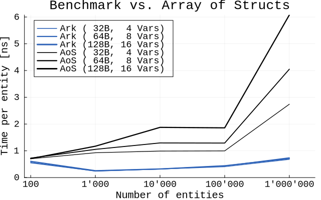
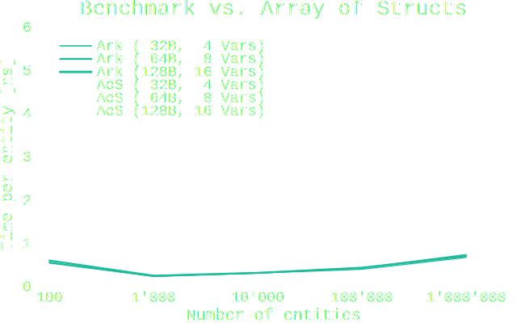

# Benchmarks

Several performance benchmarks for Ark.jl.

More to come soon...

## Ark vs. AoS

The figure below shows the classical Position/Velocity (movement system) benchmark,
comparing Ark with the Array of Structs approach.
Note that the data is from runs on the powerful GitHub CI machines.
These have way more cache then consumer machines, where the performance advantage
of Ark would be even more emphasized.

```@raw html


```
*Ark vs. AoS: Legend entries denote the size of entities in bytes and in the number of Float64 fields.*
